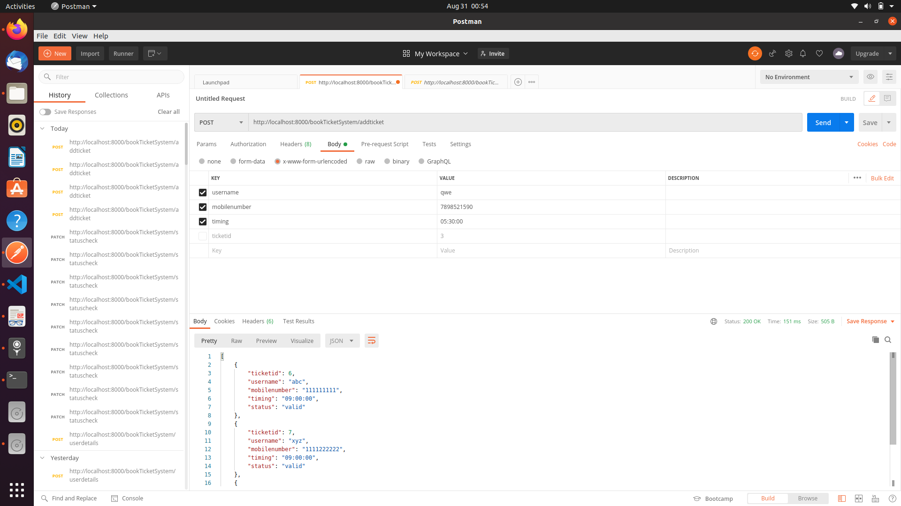
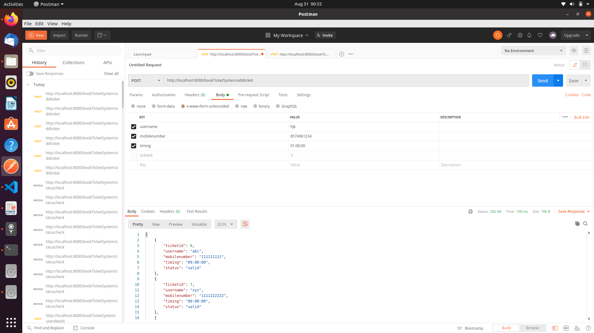
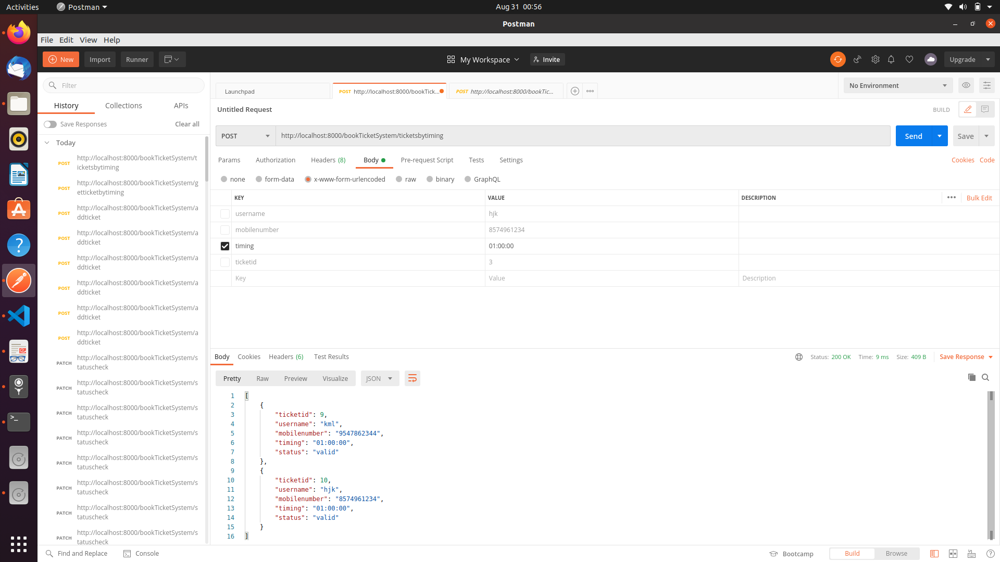
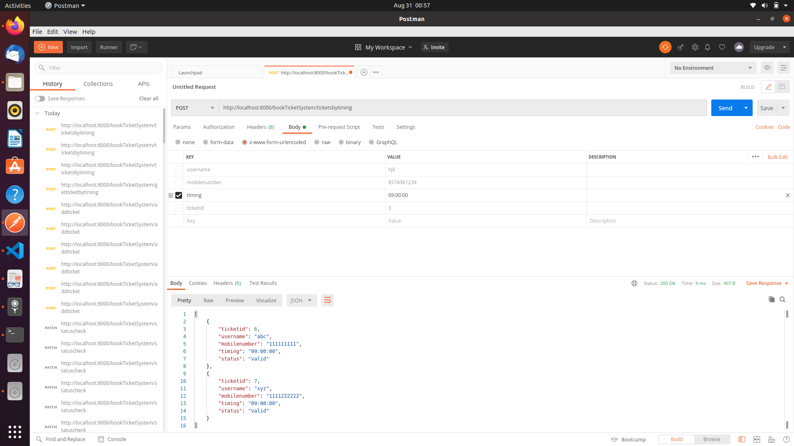
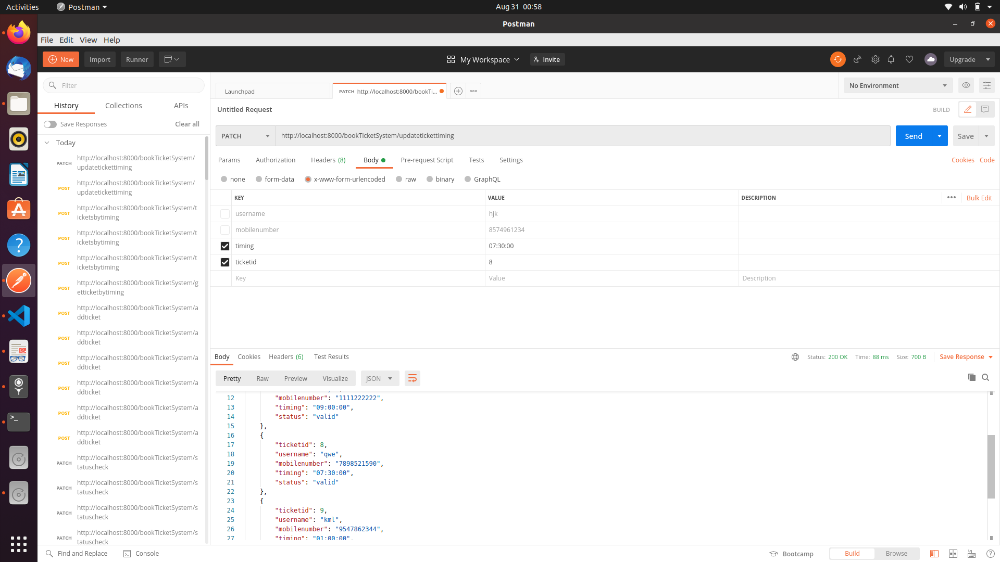
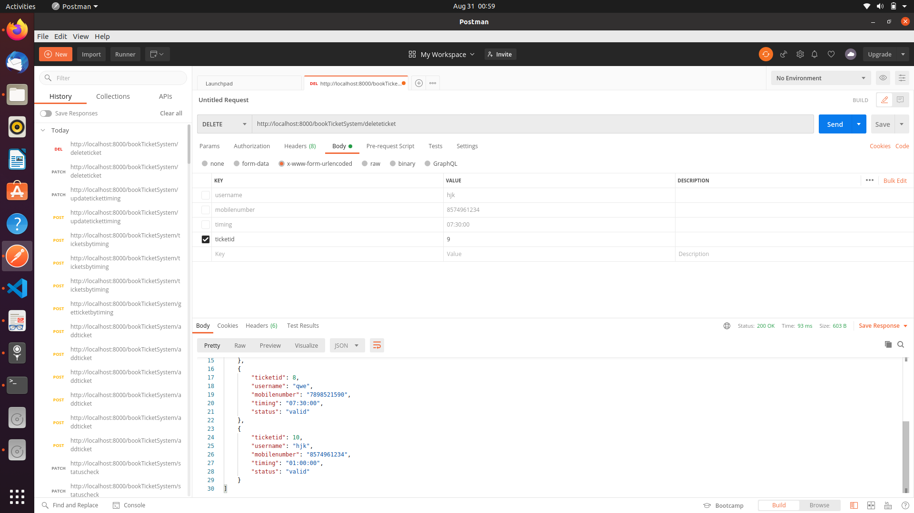
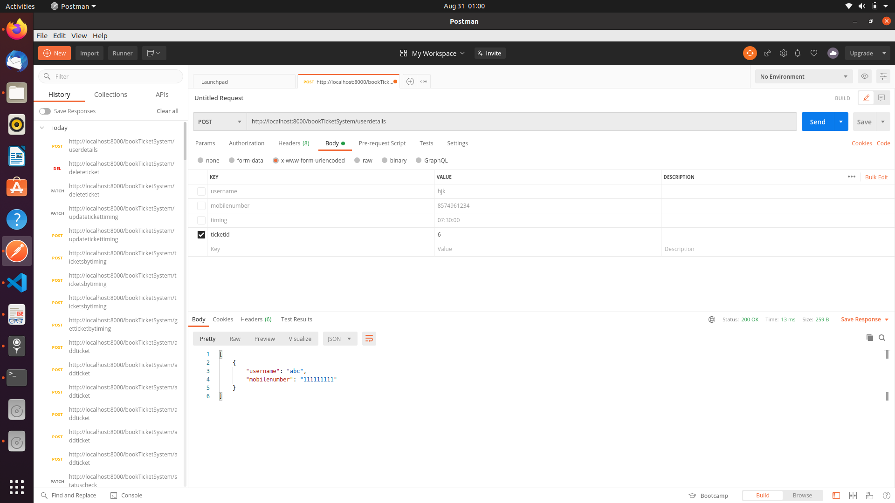
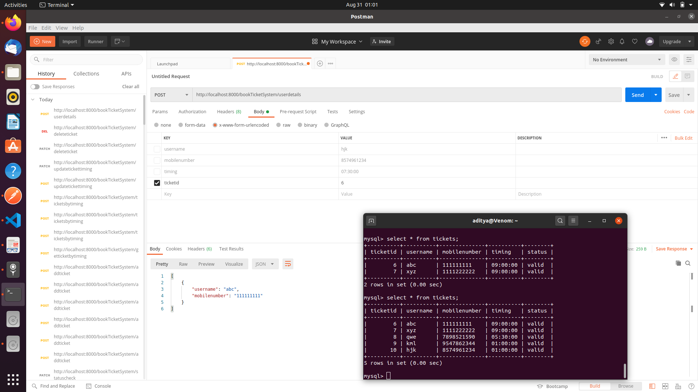

## Index
- [Index](#index)
- [About](#about)
- [Usage](#usage)
  - [Installation](#installation)
- [Endpoints](#endpoints)

## About
This will be a free to use, open sourced questions database which has a REST API implemented in javascript & Nodejs using MySQL database,

## Movie Ticket Booking System
You can book, update, delete, checkstatus and checkuserdetails of your movie ticket.
This is a repo for a starter application for a Single Page application. Just download and install and you have a good foundation for building application.

Make sure you have Node.js and Mysql Installed on your local system. Install Postman for testing the application and follow below given installation procedure on the Command Line / Terminal

## Installation

   1. Download the repository
   2. Install npm modules: npm install
   3. Install mysql2: npm install mysql2
   4. Start up the server: node server.js
   5. Try out using postman.
   
## Endpoints

Available Views`
- [x] https:localhost:8000/bookTicketSystem          

`Available Endpoints`

- Movie Ticket Booking
    - [x] `POST /addticket` **(Book a Ticket: Pass Username, Mobile Number, Movie timing)**
    

    

    
    
    - [x] `POST /ticketsbytiming` **(View all tickets for particular time: Pass Movie time of which tickets you want to see)**
    

    

    

    
    
    - [x] `PATCH /updatetickettiming` **(Update a ticket timing: Pass ticket id and new timing to update movie timings)**
    

    
    
    - [x] `DELETE /deleteticket` **(Delete a particular ticket: Pass ticket id to delete ticket)**
    

    
    
    - [x] `POST /userdetails` **(User details by ticked id: Pass ticket id to see user details)**
    

    

    
    
    - [x] `PATCH /statuscheck` **(Check status whether the user is expired & deleted expired ticket automatically whenever user checked them)**
